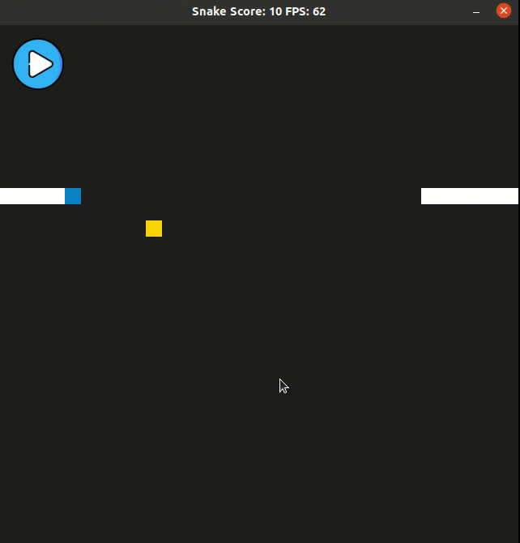

# CPPND: Capstone Snake Game Example

This is a Capstone project implementation of the [Udacity C++ Nanodegree Program](https://www.udacity.com/course/c-plus-plus-nanodegree--nd213). Option 2 was chosen as the final project - improving 2D Snake game.

The starter code was provided by Udacity and could be found [here](https://github.com/udacity/CppND-Capstone-Snake-Game). 
To satisfy the Rubric Points, new functionality was added, such as a start/pause button, and some refactoring of the existing code was made.
## Dependencies for Running Locally
* cmake >= 3.7
  * All OSes: [click here for installation instructions](https://cmake.org/install/)
* make >= 4.1 (Linux, Mac), 3.81 (Windows)
  * Linux: make is installed by default on most Linux distros
  * Mac: [install Xcode command line tools to get make](https://developer.apple.com/xcode/features/)
  * Windows: [Click here for installation instructions](http://gnuwin32.sourceforge.net/packages/make.htm)
* SDL2 >= 2.0
  * All installation instructions can be found [here](https://wiki.libsdl.org/Installation)
  >Note that for Linux, an `apt` or `apt-get` installation is preferred to building from source. 
* SDL2_image >= 2.0
  * All installation instructions can be found [here](https://www.libsdl.org/projects/SDL_image/docs/index.html)
  >Note that for Linux, an `apt` or `apt-get` installation is preferred to building from source: 
  `sudo apt-get install libsdl2-image-2.0-0-dev`
* gcc/g++ >= 5.4
  * Linux: gcc / g++ is installed by default on most Linux distros
  * Mac: same deal as make - [install Xcode command line tools](https://developer.apple.com/xcode/features/)
  * Windows: recommend using [MinGW](http://www.mingw.org/)

## Basic Build Instructions

1. Clone this repo.
2. Make a build directory in the top level directory: `mkdir build && cd build`
3. Compile: `cmake .. && make`
4. Run it: `./SnakeGame`.

## Project specification

The project specification indicates which rubric points were addressed and it indicates where in the code (i.e. files and line numbers) that the rubric points were addressed.

* README
  * The README is included with the project and has instructions for building/running the project.
  * One additional library (SDL2_image) is needed to run the project and it is indicated with cross-platform installation   instructions.
  * Writeup is submitted as markdown.
  * The README describes the project that was built.
  * The README indicates the file and class structure, along with the expected behavior or output of the program.
  * The README indicates which rubric points are addressed. The README also indicates where in the code that the rubric points are addressed.
* Compiling and Testing
  * The code compiles and runs without errors. `cmake` and `make` were chosen as build system.
* Loops, Functions, I/O
  * A variety of control structures are used in the project both in the starter code (main function, Snake class, Game class, Renderer class and Controller class) and in the added [Button](https://github.com/bogdan-kovalchuk/CppND-Capstone-Snake-Game/blob/master/src/button.h) class. 
  * The project code is clearly organized into functions.
  * The button pictures are [read](https://github.com/bogdan-kovalchuk/CppND-Capstone-Snake-Game/blob/master/src/button.cpp#L80) from the assets files.
  * The project accepts input from a user as start/pause game with button.
* Object Oriented Programming
  * The project code is organized into classes with class attributes to hold the data, and class methods to perform tasks. New class [Button](https://github.com/bogdan-kovalchuk/CppND-Capstone-Snake-Game/blob/master/src/button.h) was added that satisfy this requirement.
  * All class data members (existing and added) are explicitly specified as public or private.
  * Class members are initialized through member initialization lists. As one example is Game class [constructor](https://github.com/bogdan-kovalchuk/CppND-Capstone-Snake-Game/blob/master/src/game.cpp#L5).
  * All class member functions document their effects, either through function names or comments. For example Button class member function [Button::Render](https://github.com/bogdan-kovalchuk/CppND-Capstone-Snake-Game/blob/master/src/button.cpp#L29) - render button texture or member function [Button::ChangeState](https://github.com/bogdan-kovalchuk/CppND-Capstone-Snake-Game/blob/master/src/button.cpp#L47) changes the state of the button from pause to play and vice versa. Also, member functions do not change program state in undocumented ways.
  * Appropriate data and functions are grouped into classes. Member data that is subject to an invariant is hidden from the user for example member function to load pictures from file - [Button::LoadImageFromFile](https://github.com/bogdan-kovalchuk/CppND-Capstone-Snake-Game/blob/master/src/button.cpp#L80) is private. State is accessed via member functions for example [Button::GetPosition](https://github.com/bogdan-kovalchuk/CppND-Capstone-Snake-Game/blob/master/src/button.cpp#L75).
  * Inheritance wasn't used in the project.
  * Functions were not overloaded in this project
  * The member functions were not overloaded or declared as virtual in this project
  * Templates were not used in this project
* Memory Management
  * At least two variables passed by reference in function for example `controller` and `renderer` passed by reference in function [Game::Run](https://github.com/bogdan-kovalchuk/CppND-Capstone-Snake-Game/blob/master/src/game.cpp#L14).
  * There wasn't used dynamically allocated memory that was allocated with operator `new`.
  * The project doesn't use RAII.
  * In Button class the copy constructor, copy assignment operator, move constructor, move assignment operator were deleted to not allow copy/and assign button.
  * Move wasn't used in the project.
  * The project uses smart pointer `unique_ptr` for [sdl_window](https://github.com/bogdan-kovalchuk/CppND-Capstone-Snake-Game/blob/master/src/renderer.h#L23).
* Concurrency
  * Due to the limited time and complexity of implementation, multithreading was not used in this project.

## CC Attribution-ShareAlike 4.0 International

Shield: [![CC BY-SA 4.0][cc-by-sa-shield]][cc-by-sa]

This work is licensed under a
[Creative Commons Attribution-ShareAlike 4.0 International License][cc-by-sa].

[![CC BY-SA 4.0][cc-by-sa-image]][cc-by-sa]

[cc-by-sa]: http://creativecommons.org/licenses/by-sa/4.0/
[cc-by-sa-image]: https://licensebuttons.net/l/by-sa/4.0/88x31.png
[cc-by-sa-shield]: https://img.shields.io/badge/License-CC%20BY--SA%204.0-lightgrey.svg
